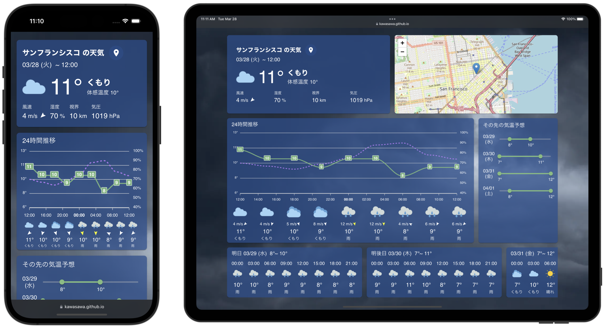
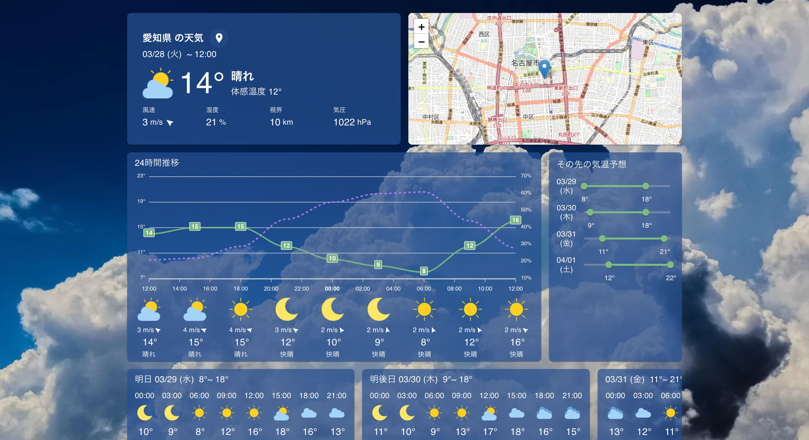

# ひより

## 概要

気象情報を一覧できる Web サイトです。現在位置における直近から数日先までの三時間ごとの天気、気温、湿度、風の情報をまとめて確認できます。

### 表示される情報

1. 天気
1. 温度
1. 体感温度
1. 風速
1. 湿度
1. 視界
1. 気圧

## 技術情報

本プログラムは以下を主な基盤として使用し、構築されています。  
OpenWeatherMap から提供される API により気象情報を取得、Leaflet を使用し位置情報を可視化します。

|                              | 技術スタック                                  |
| ---------------------------- | --------------------------------------------- |
| 開発言語                     | [TypeScript](https://www.typescriptlang.org/) |
| フロントエンドフレームワーク | [React](https://ja.reactjs.org/)              |
| CSS フレームワーク           | [MUI (Material UI)](https://mui.com/)         |
| リンター                     | [ESLint](https://eslint.org/)                 |
| フォーマッター               | [Prettier](https://prettier.io/)              |
| パッケージマネージャー       | [Yarn](https://yarnpkg.com/)                  |
| 地図表示ライブラリ           | [Leaflet](https://leafletjs.com/)             |
| 気象情報 API                 | [OpenWeatherMap](https://openweathermap.org/) |

以上
